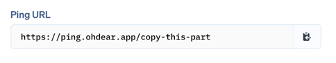

# Easily integrate cronjob monitoring from OhDear into your Laravel application.

[](https://packagist.org/packages/marlonbasten/ohdear-croncheck-laravel)
[](https://github.com/marlonbasten/ohdear-croncheck-laravel/actions?query=workflow%3Arun-tests+branch%3Amain)
[](https://github.com/marlonbasten/ohdear-croncheck-laravel/actions?query=workflow%3A"Fix+PHP+code+style+issues"+branch%3Amain)
[](https://packagist.org/packages/marlonbasten/ohdear-croncheck-laravel)

Monitoring cronjobs with OhDear made easy! Just register your commands in a service provider.

```php
public function boot(): void
{
    OhDearCron::register(TestCommand::class, 'id');
}
```

## Installation

You can install the package via composer:

```bash
composer require marlonbasten/ohdear-croncheck-laravel
```

You can publish the config file with:

```bash
php artisan vendor:publish --tag="ohdear-croncheck-laravel-config"
```

This is the contents of the published config file:

```php
return [
    // If false, cronjobs will always be sent to OhDear
    'only_in_prod' => true,
    // The ping URL for OhDear (https://ohdear.app/docs/features/cron-job-monitoring#php)
    'ohdear_url' => 'https://ping.ohdear.app',
];
```

## Usage

Register the command you want to monitor with OhDear in any service provider using the Facade.

```php
public function boot(): void
{
    \Marlonbasten\OhdearCroncheckLaravel\Facades\OhDearCron::register(TestCommand::class, 'id');
}
```

The `id` is the last part of your ping URL you get on OhDear.



<b>That's it!</b> Now every time the command runs, OhDear will receive a ping.<br />
The package will also send the exit code and the runtime of the command to OhDear.

## Changelog

Please see [CHANGELOG](CHANGELOG.md) for more information on what has changed recently.

## Contributing

Please see [CONTRIBUTING](CONTRIBUTING.md) for details.

## Security Vulnerabilities

Please review [our security policy](../../security/policy) on how to report security vulnerabilities.

## Credits

- [Marlon Basten](https://github.com/marlonbasten)
- [All contributors](../../contributors)

This package was inspired by [Freek Van der Herten](https://github.com/freekmurze)

## License

The MIT License (MIT). Please see [License File](LICENSE.md) for more information.
